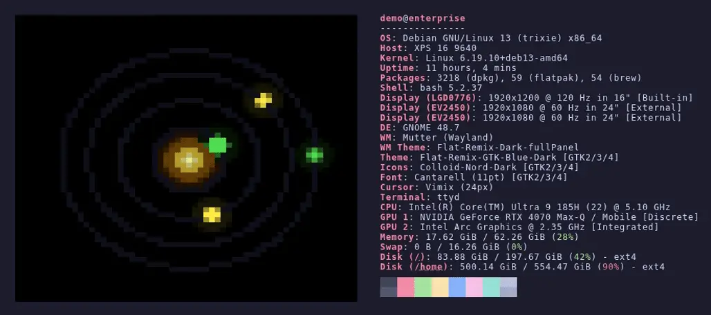

# solarust 🪐

A random solar system simulator that runs entirely in your terminal.

default


with shaded planets


respekting terminal theme (example shows Catppuccin Mocha)


---

## Features

- 3–8 randomly generated planets per system
- Planets orbit the sun at varying speeds (Kepler-inspired: inner planets faster)
- Elliptical orbits that adapt to your terminal's aspect ratio
- Rendered with Unicode half-block characters (`▀`) for smooth, pixel-style graphics
- Phosphor-glow trails via per-frame intensity decay
- Day/night shading: the side of each planet facing away from the sun is darkened
- Planet and orbit sizes scale with terminal dimensions
- Color theme support: built-in `dark`/`light` themes or `ansi` to use the terminal's own palette (Catppuccin, Dracula, Solarized, …)
- Intro and supernova outro animations
- Responds to terminal resize

## Requirements

- A terminal with true color (24-bit) support
- Rust toolchain (`cargo`) for building from source

## Installation

### Pre-built packages

Download the latest package for your distribution from the
[GitHub Releases](https://github.com/the-unknown/solarust/releases) page:

| Distribution     | Package                               | Install command                            |
| ---------------- | ------------------------------------- | ------------------------------------------ |
| Debian / Ubuntu  | `solarust_<version>_amd64.deb`        | `sudo dpkg -i solarust_*.deb`             |
| Fedora / RHEL    | `solarust-<version>-1.x86_64.rpm`     | `sudo rpm -i solarust-*.rpm`              |
| Arch Linux       | `solarust-<version>-1-x86_64.pkg.tar.zst` | `sudo pacman -U solarust-*.pkg.tar.zst` |
| Any Linux        | `solarust-<version>-x86_64-linux.tar.gz`  | Extract and copy binary to your `$PATH`  |

### Arch Linux (AUR)

solarust is available in the [AUR](https://aur.archlinux.org/packages/solarust):

```bash
# with your preferred AUR helper, e.g.:
yay -S solarust
# or manually:
git clone https://aur.archlinux.org/solarust.git
cd solarust && makepkg -si
```

### From source

```bash
git clone https://github.com/the-unknown/solarust
cd solarust
make && make install
```

Installs to `~/.local/bin/solarust` by default. To install system-wide:

```bash
sudo make install PREFIX=/usr/local
```

To uninstall:

```bash
make uninstall
```

## Usage

```bash
solarust [OPTIONS]
```

| Option         | Description                                               |
| -------------- | --------------------------------------------------------- |
| `-p <n>`       | Start with exactly `n` planets                            |
| `-s`           | Start with day/night shading enabled                      |
| `-t <theme>`   | Color theme: `dark` (default), `light`, or `ansi`         |
| `--once`       | Render a single frame to stdout and exit (for fastfetch)  |
| `--size <WxH>` | Canvas size for `--once`, e.g. `60x30` (default: `60x30`) |
| `-h`           | Show help and exit                                        |

### fastfetch integration

Use `--once` to render a static frame suitable for piping into
[fastfetch](https://github.com/fastfetch-cli/fastfetch):

```bash
# one-shot: render to a file, then use as logo
solarust --once --size 60x30 > ~/.cache/solarust.ans
fastfetch --logo-type file-raw --logo ~/.cache/solarust.ans \
          --logo-width 60 --logo-height 29
```

Add the two lines to your shell's rc file (`.bashrc` / `.zshrc`) to get a fresh
system each time a new terminal opens:

```bash
solarust --once --size 60x30 -t ansi > ~/.cache/solarust.ans
fastfetch --logo-type file-raw --logo ~/.cache/solarust.ans \
          --logo-width 60 --logo-height 29
```



### `-t ansi`

Queries the terminal's ANSI color palette via OSC escape sequences and uses
those colors for the planets and orbits. This means the simulation automatically
matches any theme you have configured — Catppuccin, Dracula, Solarized, Gruvbox,
and so on. Falls back to `dark` if the terminal does not support the query.

**tmux users:** OSC passthrough must be enabled in your `tmux.conf` (requires tmux ≥ 3.3):

```
set -g allow-passthrough on
```

| Key | Action                   |
| --- | ------------------------ |
| `q` | Quit                     |
| `r` | Generate new system      |
| `s` | Toggle day/night shading |

## Building manually

```bash
cargo build --release
./target/release/solarust
```

## License

Apache-2.0
