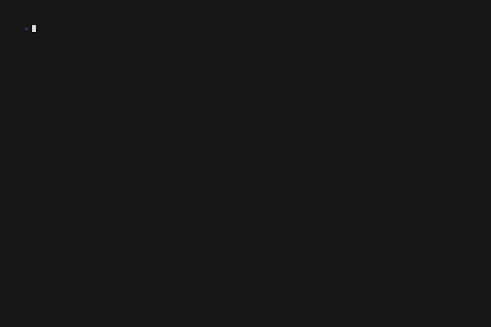
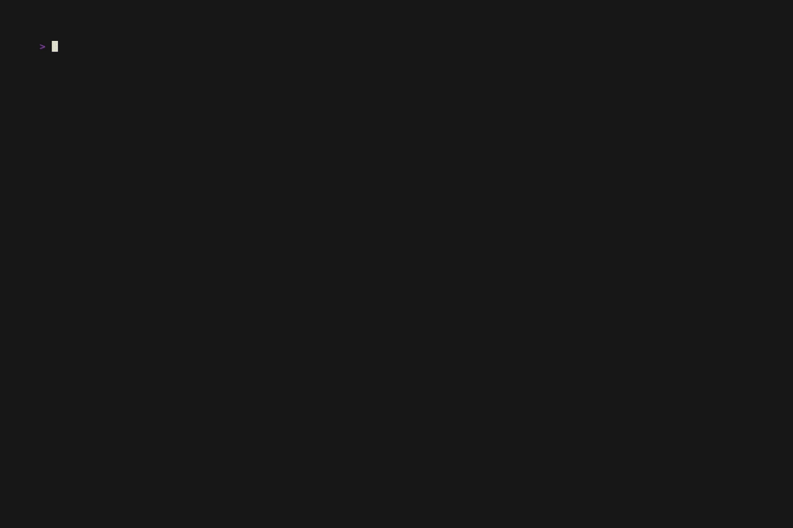

# solarust 🪐

A random solar system simulator that runs entirely in your terminal.

default


with shaded planets


---

## Features

- 3–8 randomly generated planets per system
- Planets orbit the sun at varying speeds (Kepler-inspired: inner planets faster)
- Elliptical orbits that adapt to your terminal's aspect ratio
- Rendered with Unicode half-block characters (`▀`) for smooth, pixel-style graphics
- Phosphor-glow trails via per-frame intensity decay
- Day/night shading: the side of each planet facing away from the sun is darkened
- Planet and orbit sizes scale with terminal dimensions
- Intro and supernova outro animations
- Responds to terminal resize

## Requirements

- A terminal with true color (24-bit) support
- Rust toolchain (`cargo`) for building from source

## Installation

```bash
git clone https://github.com/the-unknown/solarust
cd solarust
make && make install
```

Installs to `~/.local/bin/solarust` by default. To install system-wide:

```bash
sudo make install PREFIX=/usr/local
```

To uninstall:

```bash
make uninstall
```

## Usage

```bash
solarust [OPTIONS]
```

| Option   | Description                          |
| -------- | ------------------------------------ |
| `-p <n>` | Start with exactly `n` planets       |
| `-s`     | Start with day/night shading enabled |
| `-h`     | Show help and exit                   |

| Key | Action                   |
| --- | ------------------------ |
| `q` | Quit                     |
| `r` | Generate new system      |
| `s` | Toggle day/night shading |

## Building manually

```bash
cargo build --release
./target/release/solarust
```

## License

Apache-2.0
